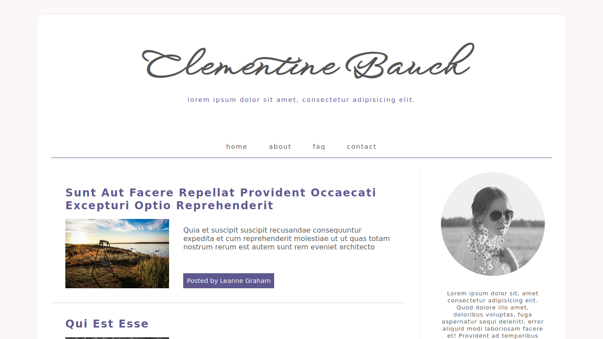
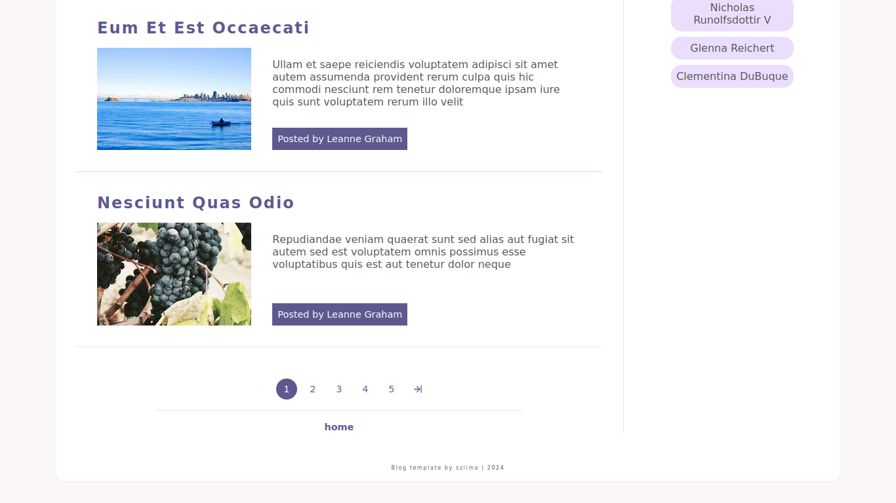
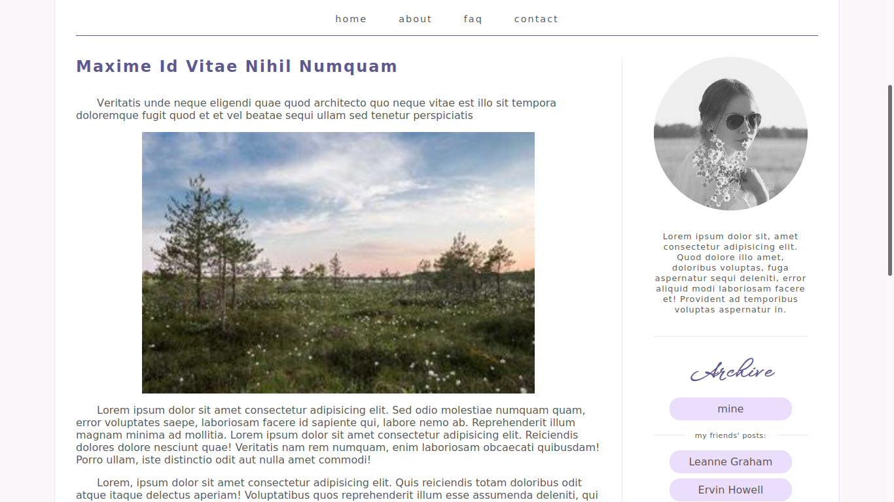
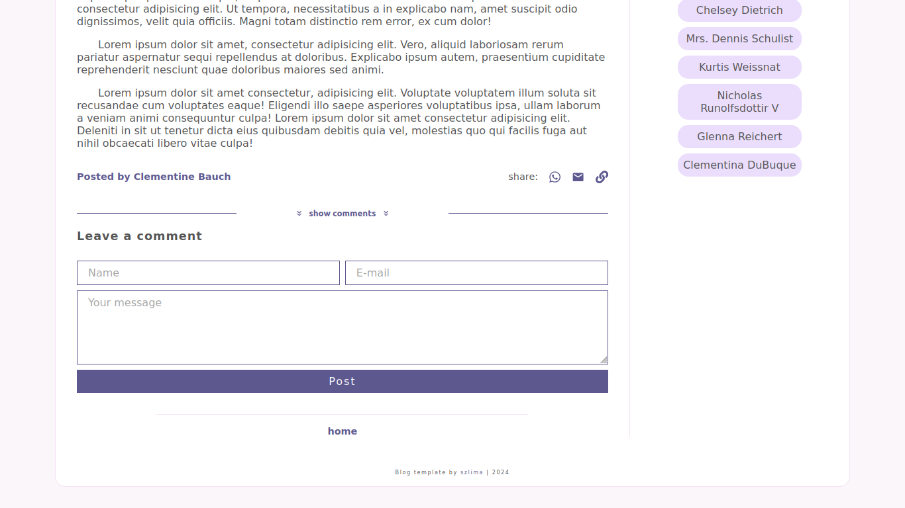
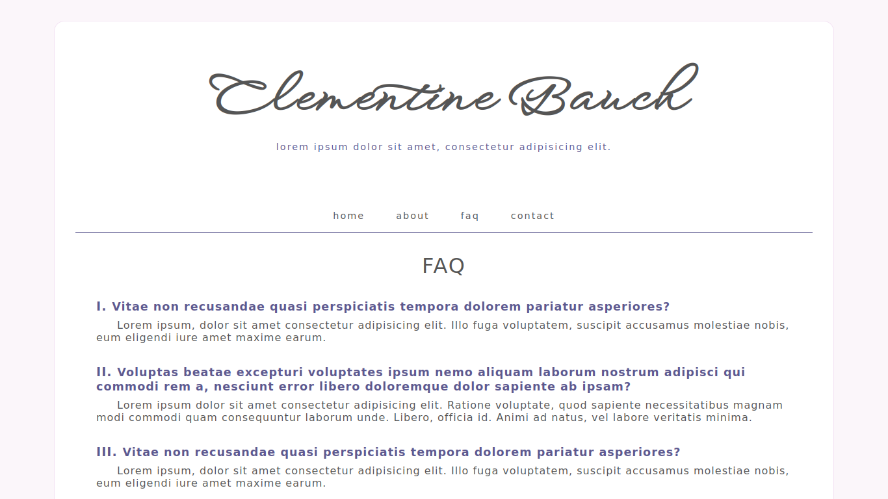
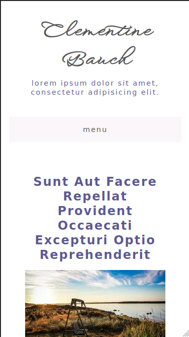
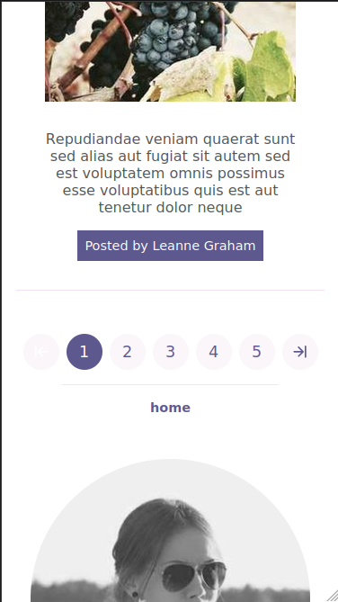
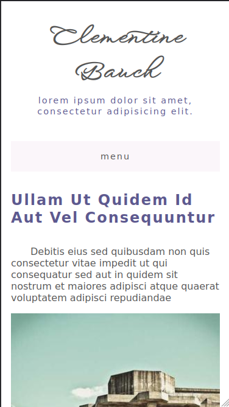
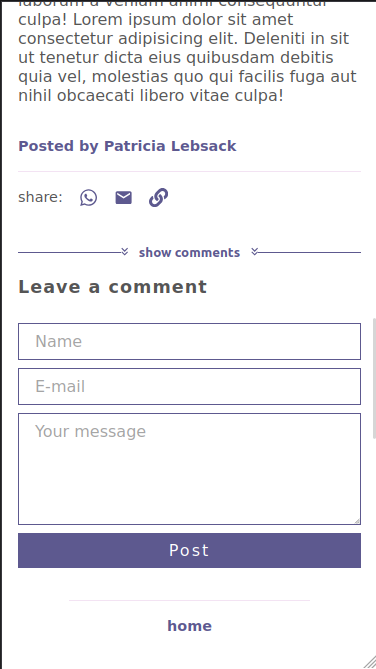

# :desktop_computer: Blog

Este projeto apresenta um blog fictício. Em sua página principal são apresentadas a lista de postagens, o perfil com um resumo sobre seu dono e uma seção de escritos filtrados por autor. Ao selecionar uma pŕevia de postagem da lista apresentada, uma nova página é carregada para a apresentação da postagem completa. A página de uma postagem possibilita a visualização de seus comentários além da inclusão de novos. Também são disponibilizados recursos para o compartilhamento da mesma. Através do menu superior também foram disponibilizadas páginas com informações sobre o blog, perguntas frequentes e contato.

Além de HTML, CSS e JavaScript o desenvolvimento utilizou a biblioteca React junto com alguns de seus hooks. Como foram executadas operações assíncronas no projeto, foi necessário lidar com conceitos como promises, callbacks, async e await. Para trabalhar com requisições HTTP utilizou-se a biblioteca Axios. Os dados relacionados às postagens, comentários e autores foram consumidos da API REST [JSONPlaceholder](https://jsonplaceholder.typicode.com/). Já as imagens são provenientes do site [Lorem Picsum](https://picsum.photos/).

Os estados foram gerenciados através da Context API. Assim, informações como a lista de postagens ou qual é a postagem selecionada foram fornecidas e alteradas por seus respectivos contextos. O suporte ao gerenciamento de rotas de página foi possível graças a biblioteca React Router.

Na estilização foi utilizado o pré-processador Sass. Foram aplicados os recursos de aninhamento de estilos, uso de mixins e armazenamento de dados em variáveis. O design da aplicação é responsivo.

## :gear: Tecnologias

- HTML
- CSS
- JavaScript
- Asynchronous JavaScript
- React
- React Icons
- React Hooks
- React Context API
- React Router
- Sass

## :art: Layout

